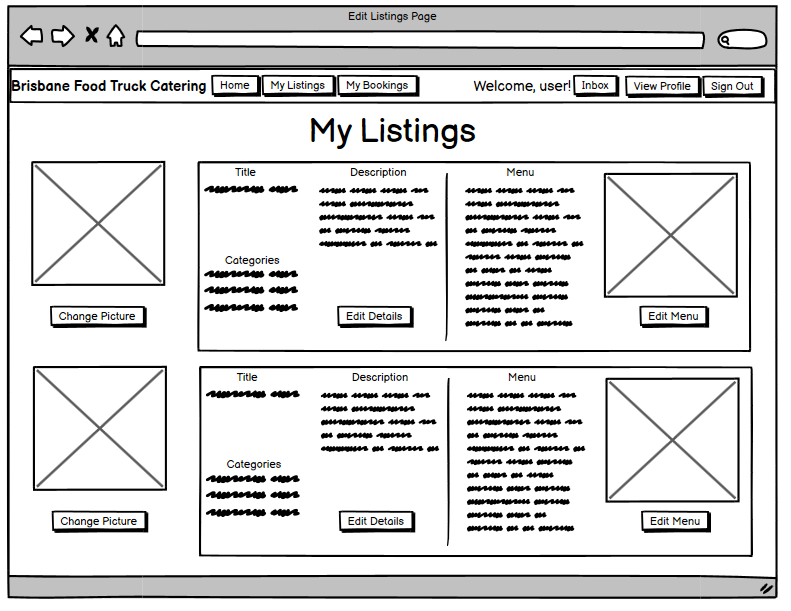

# README

## The Problem
The popularity of food trucks has increased rapidly over the past several year, outpacing the growth of the restaurant industry. They attract customers by serving areas with high foot traffic but also do business through catering for events as their flexibility with location makes them uniquely suited to this task. Therefore, customers looking for to have their events catered for need a reliable and centralised location to browse for local food trucks. Currently, there is a Brisbane City council website which lists Brisbane food trucks, but it merely contains a short description and contact information, with some listings containing no information at all. Thus, a reliable platform does not currently exist.

## The Solution
I have created a two-way marketplace called Brisbane Food Truck Catering to solve the above problem. It connects Brisbane food truck owners with customers by allowing owners to create listings for their food trucks, which customers may book for a certain date and location. The customer pays through the site and we take a small percentage as a service fee. When users sign up, they can either choose to be a buyer or a seller. <ins>**It is currently a work in progress.**</ins>

## Features

Buyers can browse all the listings and seach for terms such as a specific categories, menu items or available dates. They can book a listing and input their requested date, address and other additional information. They can then view their bookings from the my bookings tab. 

Sellers can create listings and upload images of their food truck and menu. They can specify which dates are available. They can also view the bookings for their specific listings. 

Upon signing up, users must provide an email, phone number and name as well as whether they want to be a buyer or seller.

When a booking is created, the owner of the listing will receive a notification in their inbox. The owner can then choose to accept or decline the booking. Users can also send and receive messages to each other through the inbox system

## Tech Stack
- Built using Ruby on Rails
- Styled with Bootstrap
- Hosted on Heroku
- File upload using Cloudinary

## Third Party Servies
The website itself is hosted on the cloud platform Heroku.

All image uploads relating to listings and menus are uuploaded to a CDN called Cloudinary

## Site Map


## Entity Relationship Diagram


**Listing**

Its purpose is to store the information of the listing. It contains the title, user profile id (to establish the owner of the listing), price and description of the listing. It has:
- One and only one user profile (the owner of the listing)
- Zero or many unavailble dates
- One or many menus (a listing may have a separate mains and dessert menu for example)
- Many categories (established through the listing_category table)
- Zero or many reviews made by other users
- Zero or many bookings made by other users

**User_Profile**

Its purpose is to store the profile information of a particular user. It contains the name and phone number. It has:
- Zero or many messages (sent by the user)
- One and only one inbox 
- Zero or many reviews made by the user
- Zero or many bookings made by the user
- One and only one user (login information)

**User**

Its purpose is to store the login details of a user. It contains the email and password of the user. It has:
- One and only one user profile
- One or many roles (established by the user_role table)

**Role**

Its purpose is to define the names of roles which users can have. This allows authorization to be performed on users and determines what resources they have access to. It has:
- One or many users (one role can be assigned to multiple users)

**Booking** 

The purpose is to store the information of a booking. It contains the listing id (to establish which listing has been booked), user profile (to establish which user made this booking), the address, the date and additional comments. It has:

- One and only one listing
- One and only one user profile (the user who made the booking)

**Menu**

Its purpose is to define a particular menu. It contains the title of the menu and the listing id which it belongs to. It has:
- One and only one listing
- One or many menu items

**Menu_Item**

Its purpose is to store information about a particular menu item. It contains the name of the item, a description of the item and the associated menu id. It has:
- One and only one menu

**Unavailable_Date**

Its purpose is to store the dates which are unavaible for booking for a particular listing. It contains the date and the listind id which is associated. It has:
- One and only one listing

**Category**
Its purpose is to store the various categories which listings are categorized by. It contains the name of the particular category. It has:
- Zero to many listings (established throug the listing_category table)

**Review**
Its purpose is to store information regarding a review of a particular listing. It contains the listing id of the listing which it belongs to, the user profile id of the user who created the review, the review content, the rating and the date on which it was created. It has:
- One and only one listing (which is belongs to)
- One and only user profile (the author of the review)

**Inbox** 

Its purpose is to keep and index of the the messages received by a particular user. It contains the user profile id of the user who owns the inbox and the message id of received messages. It has:
- One and only one user profile
- Zero or many messages

**Message** 

Its purpose is to store information of sent messages. It contains the message content, the inbox id of the inbox which it was sent to, the date at which it was sent and the user profile id of the sender. It has:
- One and only one inbox which is was sent to
- One and only one user profile which sent the message

## Model Associations

**Booking**
- ```belongs_to :listing``` as booking is made from a listing and cannot exist without a listing
- ```belongs_to :user_profile``` as a booking is made by a user profile and cannot exist without a related user profile

The CRUD operations are defined in the bookings controller and aside from destroy, each have their own views.

**Category**
- ```has_many :listing_categories``` to create the many to many relationship
- ```has_many :listings, through: :listing_categories``` as a category may appear in many different listings

The CRUD operations for categories has not been implemented yet, but will only have views for create and update and reading the categories can be done from other views such as the new listings view.

**ListingCategory**
- Establishes the joining table which enables the many to many relationship between categories and listings and vice versa

**Listing**
- ```belongs_to :user_profile``` as the user_profile creates the listing
- ```has_many :menus``` as a listing can have many menus
- ```has_many :bookings``` as a listing can be booked by multiple users
- ```has_many :listing_categories``` as a listing can have multiple categories
- ```has_many :categories, through: :listing_categories``` to establish the many to many relationship of categories to listings

The CRUD operations are defined in the listings controller and aside from destroy, each have their own views.

**MenuItem**
- ```belongs_to :menu``` as menu items must be associated with a particular menu

The CRUD operations for menus items has not been implemented yet, but will only have views for create and update and reading the menu items will be done from the show listings view.

**Menu**
- ```has_many :menu_items``` as a menu contains many different menu items
- ```belongs_to :listing``` as a menu must be associated with a particular listing

The CRUD operations for menus has not been implemented yet, but will only have views for create and update and reading the menu items will be done from the show listings view.

**Role**
- ```has_and_belongs_to_many :users``` as a user can have many different roles through a user_roles join table

The CRUD operations for menus has not been implemented yet, but will only have views for create and update and reading the menu items will be done from the show listings view.

**UserProfile**
- ```has_many :listings``` as a user can create many different listings
- ```has_many :bookings``` as a user can have multiple bookings 

The CRUD operations for user profiles are handled by the user controller as the user model accepted nested attributes for user profiles. 

**User**
- ```has_one :user_profile``` as a user has a profile which contains information about them

The CRUD operations are handled by the devise gem. The registrations controller for users also handles CRUD operations for user profiles.

## Implementation Plan
[Trello Board](https://trello.com/b/bCSyqXWg/marketplace-app)

## Link to the Website
[Brisbane Food Truck Catering](https://cryptic-sea-78195.herokuapp.com/)

## Link to Github Repo
[Github Repo](https://github.com/pacxis/HudsonXiaoYuan_T2A2)

## Wireframes





## Screenshots


 
